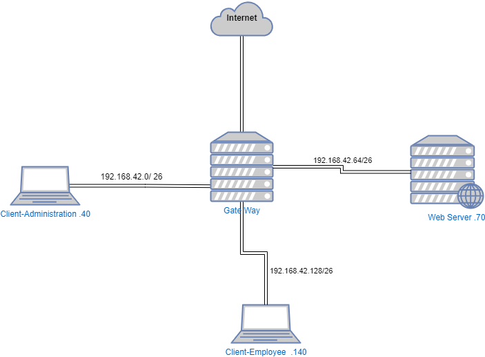

# T-NSA-501-PAR_13
Here is the content reformatted as a **README** file:

---

# README: Network Gateway, Web Server, and Client Configuration  

## 1. Infrastructure Diagram  
The project setup consists of a network infrastructure that includes a gateway, web server, and clients. The infrastructure diagram is as follows:  

  

- **Gateway** connects to three LANs and the internet.  
- **Web Server** and **Clients** are configured to interact through this network.

## 2. System Requirements  
For this project, the following components were used:  

- **Hypervisor**: VirtualBox  
- **VM1 (Gateway)**: OpenBSD with 4 network interfaces  
- **VM2 (Web Server)**: FreeBSD with 1 network interface  
- **VM3 & VM4 (Clients)**: Debian with 1 network interface  

## 3. VM1: Gateway Configuration  
The following configurations were applied to the gateway (VM1):  

- Installed OpenBSD without a graphical user interface (GUI).  
- Configured 4 network interfaces:  
  - **em0**: NAT  
  - **em1**: LAN-1  
  - **em2**: LAN-2  
  - **em3**: LAN-3  
- Configured DHCP in `/etc/dhcp.conf`.  
- Configured NAT and routing in `/etc/pf.conf`.  

## 4. VM2: Web Server Configuration  
The web server (VM2) was configured as follows:  

- Installed **NGINX**, **MySQL**, and **PHP 7.4**.  
- The system was installed without a GUI.  

## 5. VM3 and VM4: Client Configuration  
For the clients (VM3 and VM4):  

- Ensured the clients received IP addresses from the gateway's DHCP configuration.  
- Verified internet connectivity using `ping google.com`.  
- Established connections to both the gateway and web server.  
- Installed Debian with a graphical user interface (GUI).
